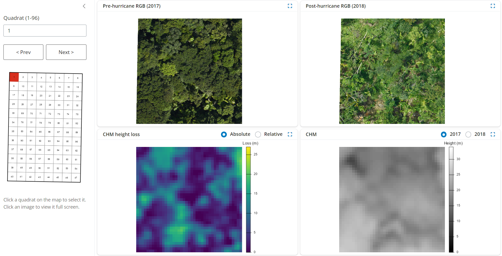

# G-LiHT Change Viewer 

---   
An RShiny App for visually assessing hurricane-driven forest loss at the Luquillo Forest Dynamics Plot (LFDP) in Puerto Rico between 2017 and 2018. 
High-resolution (3cm) RGB imagery and canopy height models (CHMs) from [Goddard's LiDAR, Hyperspectral & Thermal Imager (G-LiHT)](https://gliht.gsfc.nasa.gov/about/).
